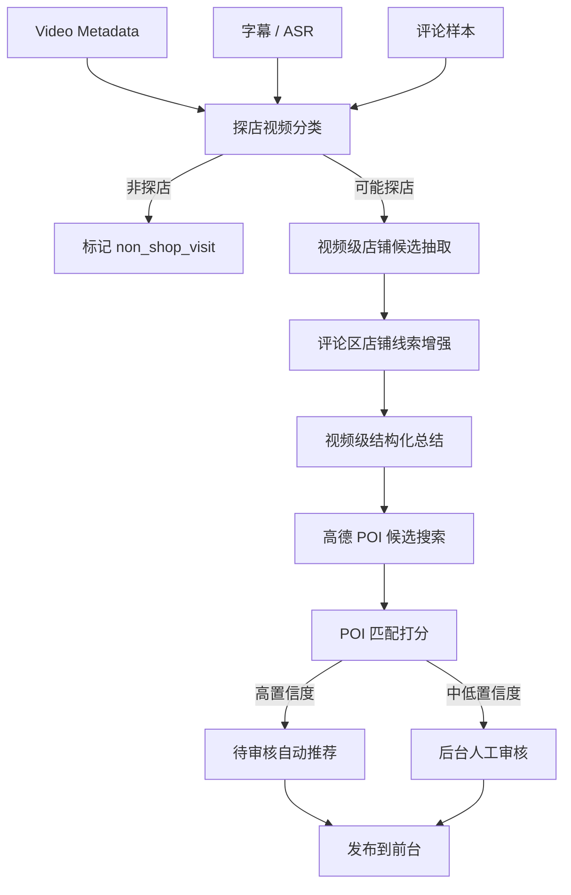

# GoWith MVP 文档：B站探店博主店铺地图

版本：v0.1  
日期：2026-06-16  
状态：MVP 方案草稿  
MVP 类型：数据闭环验证 + 可演示 Web 产品

详细实现规格：

- [AI 工作流与后台审核规格](./MVP-ai-workflow-and-admin-spec.md)
- [数据库表结构设计](./MVP-database-schema.md)

## 1. MVP 核心目标

GoWith MVP 的目标不是先覆盖全国，也不是先做完整社区，而是验证一条最关键的数据闭环：

```text
种子博主
-> 登录态 B站数据采集
-> 全量视频同步
-> 字幕获取 / Groq Whisper ASR
-> 评论区店铺相关信息提取
-> AI 视频级结构化总结
-> 候选店铺生成
-> 高德 POI 匹配
-> 后台人工审核与合并
-> 前台店铺卡片 / 地图 / 博主页展示
-> 用户行为沉淀
-> 推荐系统迭代
```

MVP 成功标准：

- 能从指定 B站 UID 自动同步全部可用视频。
- 能判断视频是否为探店视频。
- 能从字幕、ASR、标题、简介、评论中提取店铺候选。
- 能将候选店铺匹配到高德 POI。
- 能由 AI 生成足够支撑大众点评式店铺卡片的信息。
- 能通过后台人工审核修正 AI 和 POI 的错误。
- 能在 Web 端展示首页推荐、地图页、博主页、店铺详情页。
- 能记录用户行为，为后续深度学习推荐做数据准备。

## 2. MVP 范围

### 2.1 种子博主

首批 UID：

- `3546888255048212`
- `99157282`
- `1781681364`
- `544336675`
- `8263502`

MVP 范围为“几个博主的全部视频”，不做全站探店博主发现。

### 2.2 必做功能

数据侧：

- 服务端统一维护 B站登录态。
- 自动同步种子博主全部视频元信息。
- 获取视频字幕。
- 无字幕时使用 Groq Whisper ASR。
- 拉取评论区样本，重点抽取与店铺相关的信息。
- AI 生成视频级结构化数据。
- 候选店铺与高德 POI 匹配。
- 后台审核、发布、合并、驳回。

产品侧：

- 登录系统。
- 首页店铺推荐卡片流。
- 地图页，高德地图优先。
- 博主页，按博主展示视频与店铺。
- 店铺详情页。
- 后台管理系统，一个人使用即可。

推荐侧：

- MVP 前台先使用规则推荐。
- 从第一天记录用户行为，为后续深度学习推荐做训练数据。
- 预留双塔召回、深度排序模型的数据结构。

### 2.3 暂不做

- 全站自动发现探店博主。
- 商家入驻。
- 团购/交易闭环。
- 完整社交系统。
- 多人运营权限体系。
- App 原生端完整实现。
- 复杂深度学习模型线上实时服务。

## 3. 产品端形态

### 3.1 首发端

首发：Web。

原因：

- 方便快速开发和调试数据闭环。
- 店铺详情页、博主页适合 SEO 和分享。
- 后台管理系统可共用 Web 技术栈。
- 地图页开发和调试成本低于小程序/App。

### 3.2 跨端预留

后续端：

- 小程序：适合位置授权、微信分享、移动端到店决策。
- App：适合长期个性化推荐、收藏、路线、推送。

技术策略：

- 前端业务模型使用 TypeScript 类型统一。
- API 设计不绑定 Web。
- 地图 Provider 层抽象，先接高德，后续可适配小程序端地图。
- 用户行为埋点统一，不按端割裂。

## 4. 核心页面

### 4.1 首页

目标：展示类似大众点评的店铺卡片流，并由推荐系统驱动排序。

卡片信息：

- 店铺名。
- 主图或视频封面。
- 城市、商圈、距离。
- 品类。
- 人均价格，如可识别。
- 推荐菜。
- AI 一句话推荐理由。
- 博主来源。
- 视频来源数量。
- 评论区反馈标签。
- 置信度标签。
- 收藏、想去、导航、查看详情。

### 4.2 地图页

目标：按地理空间浏览博主探店结果。

功能：

- 高德地图。
- 店铺 pin。
- 聚合点。
- 按博主筛选。
- 按品类、城市、价格、置信度筛选。
- 地图范围内店铺列表。
- 点击 pin 展示店铺摘要。
- 跳转店铺详情。

### 4.3 博主页

目标：把 B站博主沉淀成“个人探店地图”。

功能：

- 博主基础信息。
- 视频同步状态。
- 探店视频数量。
- 已识别店铺数量。
- 店铺地图。
- 店铺卡片流。
- 视频列表。
- 博主口味画像。

### 4.4 店铺详情页

目标：让用户判断这家店值不值得去。

信息：

- 店铺基础信息。
- 高德 POI 信息。
- 涉及视频。
- 博主评价摘要。
- 评论区摘要。
- 推荐菜。
- 优点、缺点、争议点。
- 适合场景。
- 信息缺失提示。
- 证据来源。

### 4.5 后台管理

MVP 后台面向一个人使用，不做复杂权限。

功能：

- 管理种子博主。
- 查看视频同步任务。
- 查看视频 AI 分析结果。
- 查看候选店铺。
- 选择或修正高德 POI。
- 合并同店铺。
- 拆分误合并店铺。
- 审核发布。
- 标记非探店视频。
- 标记店铺信息不足。
- 查看模型失败原因。

## 5. 数据采集方案

### 5.1 B站登录态

方式：服务端统一登录态。

要求：

- 登录态只存服务端。
- Cookie/凭据加密存储。
- 管理后台可查看登录态是否有效。
- 任务请求必须限流。
- 请求失败要分类：登录失效、接口变更、权限不足、限流、网络错误。
- 不在前端暴露任何 B站登录凭据。

备注：

- 民间接口文档可作为内部验证参考。
- 上线产品需要重新评估 B站平台协议、授权和数据展示边界。

### 5.2 视频同步

同步对象：

- BV号/AV号。
- 标题。
- 简介。
- 封面。
- 发布时间。
- 分区。
- 标签。
- 播放、点赞、投币、收藏、评论数。
- 视频列表分页信息。
- 字幕信息。
- 评论样本。

任务策略：

- 种子博主首次全量同步。
- 后续每日增量同步。
- 视频元信息、字幕、评论、AI 分析分成独立任务。
- 每个任务有状态、重试次数、错误原因。

### 5.3 字幕与 ASR

优先级：

1. 读取可用字幕。
2. 若无字幕，抽取音频。
3. 用 Groq Whisper 转写。
4. 缓存 ASR 结果。
5. 失败则进入“文本不足”状态。

Groq Whisper 注意点：

- Groq Speech-to-Text 提供 OpenAI-compatible endpoint。
- `whisper-large-v3` 准确率更高，`whisper-large-v3-turbo` 性价比更高。
- Groq 文档显示 free tier 单文件上限为 25MB，dev tier 为 100MB。
- 长视频需要音频切片、重叠转写和结果合并。
- 建议先转为 16KHz mono，并用 FLAC 或类似格式压缩。

MVP 策略：

- 默认使用 `whisper-large-v3-turbo` 降低成本。
- 对店铺名识别失败的视频，可重跑 `whisper-large-v3`。
- ASR 输出保留 segment 时间戳，便于后续视频证据定位。

## 6. AI 工作流设计

AI 工作流是 MVP 的核心，不应只用一个 Prompt 完成所有事情。建议拆成多阶段、可缓存、可复核的工作流。

### 6.1 总体流程



### 6.2 阶段一：探店视频分类

输入：

- 标题。
- 简介。
- 标签。
- 分区。
- 字幕/ASR 摘要。
- 评论关键词。

输出：

```json
{
  "is_shop_visit": true,
  "confidence": 0.86,
  "content_type": "restaurant_visit",
  "reason": "标题和字幕多次出现店铺、菜品、排队和价格信息",
  "need_manual_review": false
}
```

边界处理：

- 美食测评但非线下店铺：标记为 `food_review_not_shop`。
- 城市旅行 vlog 包含多家店：标记为 `multi_shop_visit`。
- 只有品牌/外卖/预制菜：标记为 `not_physical_shop`。
- 置信度低于阈值：进入后台人工确认。

### 6.3 阶段二：视频级店铺候选抽取

输入：

- 标题。
- 简介。
- 字幕/ASR。
- 时间戳片段。

输出：

```json
{
  "video_id": "BV...",
  "shops": [
    {
      "candidate_name": "某某牛肉面",
      "name_confidence": 0.78,
      "city_hints": ["上海"],
      "district_hints": ["黄浦"],
      "address_hints": ["南京东路附近"],
      "shop_type": "restaurant",
      "mentioned_dishes": ["牛肉面", "卤味"],
      "price_hints": ["人均30左右"],
      "evidence": [
        {
          "source": "asr",
          "text": "这家在南京东路附近的某某牛肉面...",
          "start": 123.5,
          "end": 131.2
        }
      ],
      "missing_fields": ["exact_address"]
    }
  ]
}
```

边界处理：

- 视频没提店名：抽取城市、商圈、菜品、招牌、评论区线索，标记 `shop_name_missing`。
- 店名过于大众：标记 `generic_name_risk`，要求结合城市、商圈、地址再匹配。
- 多家店混在一个视频：每家店生成独立候选，并绑定时间段证据。
- 只说“这家店”：不能生成确定店名，只能生成待审核候选。
- 视频标题党：以字幕和评论证据为准。

### 6.4 阶段三：评论区店铺线索增强

目标：评论区不只用于情绪总结，也用于补充店名、地址、营业状态和争议点。

输入：

- 热评。
- 最新评论样本。
- 包含店名/地址/“在哪”的评论。
- 对应回复。

输出：

```json
{
  "shop_name_mentions": [
    {
      "text": "这不是XX路那家吗",
      "confidence": 0.72
    }
  ],
  "address_mentions": ["XX路", "XX商场B1"],
  "status_mentions": ["已经搬了", "最近排队很久"],
  "sentiment_summary": {
    "positive": ["味道稳定", "分量足"],
    "negative": ["排队久", "服务慢"],
    "controversial": ["价格偏贵"]
  }
}
```

边界处理：

- 评论玩梗多：只提取和店铺事实相关的信息。
- 评论区出现多个猜测店名：全部保留为候选，不直接覆盖视频抽取结果。
- 评论说店已搬/已闭店：提高人工审核优先级。
- 评论区恶意攻击或无证据负面：只做聚合，不作为事实结论。

### 6.5 阶段四：视频级结构化总结

目标：以视频为单位生成完整结构化数据，再由系统聚合到店铺维度。

输出 Schema：

```json
{
  "video": {
    "bvid": "BV...",
    "is_shop_visit": true,
    "content_type": "single_shop_visit",
    "city": "上海",
    "summary": "博主主要评价这家牛肉面分量足、汤底浓，但排队时间较长。"
  },
  "shops": [
    {
      "candidate_name": "某某牛肉面",
      "poi_match_status": "pending",
      "card": {
        "title": "某某牛肉面",
        "subtitle": "适合想吃实惠面馆的人",
        "recommend_reason": "牛肉分量足，汤底浓，评论区也多次提到性价比不错。",
        "recommendation_score": 0.86,
        "recommendation_score_evidence_ids": ["ev_201"],
        "category": "面馆",
        "recommended_dishes": ["牛肉面", "卤味"],
        "avoid_points": ["高峰期排队久"],
        "suitable_scenes": ["工作日午餐", "一人食", "附近顺路吃"],
        "tags": ["分量足", "排队", "性价比"]
      },
      "review_dimensions": {
        "taste": {
          "summary": "汤底较浓，牛肉给得多。",
          "sentiment": "positive",
          "confidence": 0.82
        },
        "service": {
          "summary": "服务信息不足。",
          "sentiment": "unknown",
          "confidence": 0.2
        },
        "environment": {
          "summary": "视频未明确提及环境。",
          "sentiment": "unknown",
          "confidence": 0.1
        },
        "queue": {
          "summary": "评论区多次提到高峰期排队。",
          "sentiment": "negative",
          "confidence": 0.74
        },
        "price": {
          "summary": "人均约30元，偏日常消费。",
          "sentiment": "positive",
          "confidence": 0.68
        }
      },
      "evidence": [],
      "missing_fields": ["exact_opening_hours"],
      "risk_flags": ["address_not_exact"]
    }
  ]
}
```

要求：

- 信息没提及就输出 `unknown`，不能编。
- 每个重要结论必须有证据来源。
- 推荐理由必须能支撑店铺卡片。
- AI 总评分表达基于博主观点的推荐程度，不得使用店铺信息置信度代替；无足够观点证据时不评分。
- 缺失字段必须显式列出。
- 风险标记进入后台审核。

### 6.6 阶段五：POI 匹配

输入：

- 店名候选。
- 城市。
- 区县。
- 商圈。
- 地址线索。
- 菜品/品类。
- 评论区线索。

高德查询策略：

1. `city + candidate_name` 关键字搜索。
2. 若候选过多，加入区县/商圈。
3. 若店名缺失，使用 `city + 商圈 + 菜品/品类` 作为低置信度检索。
4. 获取候选 POI 后做本地重排。

本地打分因子：

- 店名相似度。
- 城市一致性。
- 区县/商圈一致性。
- 地址文本相似度。
- POI 品类一致性。
- 评论区地址线索匹配。
- 是否为连锁分店。
- 是否存在闭店/搬迁风险。

输出：

```json
{
  "selected_poi": {
    "provider": "amap",
    "provider_poi_id": "...",
    "name": "某某牛肉面",
    "address": "上海市黄浦区...",
    "location": {
      "lng": 121.48,
      "lat": 31.23
    }
  },
  "match_score": 0.84,
  "match_status": "need_review",
  "candidates": []
}
```

自动化规则：

- `match_score >= 0.9` 且无风险标记：可进入待发布。
- `0.65 <= match_score < 0.9`：进入后台审核。
- `< 0.65`：不展示，仅保留候选。
- 店名缺失、同名分店多、地址缺失：必须人工审核。

### 6.7 阶段六：聚合与合并

视频级结果进入店铺维度聚合。

场景：

- 同一视频包含多个店铺。
- 不同视频识别出同一家店。
- 同一博主多次去同一家店。
- 多个博主去同一家店。
- AI 抽出不同别名，实际是同一 POI。

聚合规则：

- 以 `provider + provider_poi_id` 作为强匹配。
- 店名 + 坐标距离 + 地址相似度作为辅助匹配。
- 同一 POI 下聚合所有视频评价。
- 店铺卡片优先展示最新、最高置信度、多来源一致的摘要。
- 人工合并优先级最高。

## 7. AI 工作流状态机

Video 状态：

- `new`
- `metadata_synced`
- `subtitle_ready`
- `asr_ready`
- `text_unavailable`
- `classified`
- `non_shop_visit`
- `shop_candidates_extracted`
- `ai_structured`
- `poi_matching`
- `need_review`
- `approved`
- `published`
- `rejected`

ShopCandidate 状态：

- `extracted`
- `name_missing`
- `poi_candidates_found`
- `poi_match_low_confidence`
- `poi_match_need_review`
- `poi_matched`
- `merged`
- `approved`
- `published`
- `rejected`

ReviewTask 类型：

- 非探店确认。
- 店名缺失。
- 店名疑似错误。
- 多店铺拆分。
- POI 匹配确认。
- 店铺合并。
- AI 摘要质量低。
- 评论区存在搬迁/闭店信息。

## 8. 后台最小工作流

一个人使用后台时，优先做成任务队列。

工作台：

- 今日新增视频。
- 待确认非探店视频。
- 待确认店铺名。
- 待确认 POI。
- 待合并店铺。
- 待发布店铺。
- 失败任务。

审核详情：

- 左侧：视频标题、封面、原视频链接。
- 中间：字幕/ASR 片段、评论线索、AI 结构化结果。
- 右侧：高德 POI 候选列表、地图预览、匹配分。
- 操作：通过、驳回、修改店名、选择 POI、创建新店、合并到已有店铺、标记非探店。

## 9. 推荐系统 MVP

### 9.1 MVP 展示策略

前台先用规则推荐，避免推荐系统成为 MVP 阻塞点。

排序公式：

```text
score =
  creator_weight
  + shop_confidence
  + poi_verified_bonus
  + video_recency_score
  + multi_video_bonus
  + comment_sentiment_score
  + user_city_match
  + user_creator_follow_match
  - risk_penalty
```

### 9.2 从第一天埋点

事件：

- `shop_card_impression`
- `shop_card_click`
- `shop_detail_view`
- `map_pin_click`
- `creator_filter_apply`
- `favorite_shop`
- `want_to_go`
- `navigation_click`
- `video_source_click`
- `negative_feedback`

训练标签：

- 点击。
- 收藏。
- 想去。
- 导航。
- 停留时长。
- 原视频点击。
- 负反馈。

### 9.3 深度学习演进

V0：规则推荐。

V1：基础排序模型。

- LightGBM / XGBoost Ranker。
- 特征来自用户行为、店铺属性、博主属性、视频属性。

V2：双塔召回。

- User Tower：城市、品类、价格、关注博主、行为序列。
- Item Tower：店铺、视频、博主、城市、品类、评论情绪、Embedding。
- 输出：用户向量与店铺向量，用于 ANN 召回。

V3：深度排序。

- DeepFM / DCN / DIN。
- 加入用户最近行为序列、博主偏好、店铺文本 embedding。
- 用点击、收藏、导航作为多目标学习。

MVP 要做的不是上线 V2/V3，而是保证数据结构和日志能训练这些模型。

## 10. 技术方案

### 10.1 前端

- Web：**Next.js 14（App Router）+ React + TypeScript**，落地于 `apps/web/`。
- UI：Tailwind CSS + lucide-react 图标；M0 阶段未引入 Radix / shadcn。
- 地图：预留高德 JS API 接入位（M0 用 placeholder 网格 + 店铺点）；生产用 `NEXT_PUBLIC_AMAP_WEB_JS_KEY`。
- 状态管理：公共页使用 `fetch` + RSC；后台任务使用单例 SSE Context，并以增量轮询补偿断线事件。
- 图表：ECharts 或 Recharts（M4+）。

### 10.2 后端

- API：**Fastify** + TypeScript + @fastify/cookie/cors/swagger(-ui)；Kysely 直连 PG；Zod 入参校验；bcryptjs 密码哈希；AES-256-GCM 加密 B站 cookie。落地于 `apps/api/`。
- Worker：**Node.js + BullMQ** 消费 pipeline 队列；M0 通过 HTTP 调本地 AI worker。落地于 `apps/worker/`。
- 数据库：PostgreSQL 16 + PostGIS（落地于 `db/migrations/00{1..6}_*.sql`）。
- 任务审计：`pipeline_runs` / `pipeline_events` / `jobs` 与 BullMQ 双写，由 `enqueuePipelineRunJob` 统一创建可订阅任务。
- 缓存：Redis（docker-compose 自带）。
- 对象存储：S3 兼容（M1+ 接入，目前 raw payload 落 `raw_ingest_payloads.payload`）。
- 搜索：MVP 阶段 PostgreSQL full-text + pg_trgm；M2+ 接 OpenSearch。

### 10.3 AI 服务

- LLM：OpenAI SDK 接入（M1+），M0 阶段 `apps/ai-worker/app/main.py` 返回基于标题关键字的启发式响应。
- ASR：**Groq Whisper**，默认 `whisper-large-v3-turbo`；M0 阶段 `/asr/transcribe` 返回固定 mock。
- AI Worker：**FastAPI + Pydantic v2 + uv**，落地于 `apps/ai-worker/`；mypy strict + ruff。
- 输出校验：**双层 Zod + Pydantic**。Zod 在 `packages/shared/src/schemas.ts` 给 TS worker 用；Pydantic 在 `apps/ai-worker/app/schemas.py` 给 Python AI worker 用。
- Prompt 管理：`prompt_version` 字段在 `ai_runs`（如 `classify_video.v1`）；模型升级时同步升版。
- 结果缓存：按 `(stage, input_hash)` 重放；`ai_runs` 持久化原始输出。
- 失败重试：模型异常 / JSON 解析失败 / 字段缺失分别处理，落 `ai_runs.status ∈ {failed, invalid_json, schema_error}` + 创建 `review_tasks`。

### 10.4 地图与 POI

- Provider：高德优先（`provider='amap'`）。
- 保存 `provider + provider_poi_id`，不要只存坐标；`pois.geom` / `shops.geom` 都是 PostgreSQL GENERATED ALWAYS AS STORED，从 `lng` / `lat` 自动算出。
- 原始响应入库 `raw_ingest_payloads`，方便排查。
- POI 搜索结果缓存，降低调用成本。
- 视窗查询：`apps/api/src/routes/public.ts` 的 `/api/shops/map` 用 `shops.geom && ST_MakeEnvelope(...)`。
- 支持后续接入腾讯/百度作为备用 Provider。
- 坐标体系：`coord_type ∈ ('gcj02','bd09','wgs84')` 由 DB CHECK 强制；混用必须显式转换（`wgs84_geom` 字段尚未实现）。
- 高德 `business,photos` 返回的电话、营业时间、评分、人均、特色标签和图片保存到 `pois`，前台必须以“高德评分 / 高德人均”等来源标签展示，不能覆盖 AI 推荐评分。
- AI 结构化输出从 `video_structured_analysis.v2` 起不再生成或保存人均字段；前台人均仅使用高德 `pois.avg_cost`。
- 大众点评暂不做网页抓取或逆向接口；管理员可为审核后的 `shops` 绑定官方 HTTPS 分享链接，前台保留 GoWith 详情并提供独立点评出口。获得美团正式授权前不展示“点评评分”等字段。

高德成本依据：

- 基础搜索服务包括关键字搜索、周边搜索、多边形搜索、ID 查询、输入提示。
- 基础搜索服务个人认证月配额 5,000 次，企业认证 50,000 次，技术服务许可 500,000 次。
- 基础搜索服务流量包价格为 30 元/万次。

### 10.5 Monorepo 布局

pnpm workspaces：

```
apps/
  api/           Fastify REST API
  web/           Next.js 14（用户端 + /admin 后台，单 app）
  worker/        BullMQ pipeline 消费者
  ai-worker/     FastAPI AI/ASR 服务（uv 管理）
packages/
  db/            Kysely client + DB 类型镜像（与 SQL 有 drift，见 docs/MVP-database-schema.md §20）
  shared/        Zod schema + 枚举 + 校验工具
db/migrations/   5 个顺序 SQL 文件
scripts/
  migrate.ts     顺序应用迁移，schema_migrations 表幂等追踪
  seed-admin.ts  幂等创建 ADMIN_EMAIL 管理员账号
tests/e2e/       Playwright smoke
```

启动：

```bash
pnpm install
uv sync --project apps/ai-worker --extra dev --link-mode=copy
docker compose up -d postgres redis
pnpm db:migrate
pnpm db:seed
pnpm dev                       # concurrently 启 web + api + worker + ai-worker
```

默认端口：web=3000，api=4000（Swagger UI `/docs`），ai-worker=8000，postgres=5432，redis=6380。

### 10.6 外部模式

仓库已 Hard cut：所有 adapter（`bilibili.ts` / `poi.ts`）与 AI worker 都直接走真实外部 API。Mock 实现与 `EXTERNAL_MODE` 切换变量已删除。

- B 站：`apps/worker/src/adapters/bilibili.ts` 通过 `x/space/accinfo` + `x/web-interface/view` 拿真实数据；登录态存 `bilibili_auth_accounts.encrypted_cookie`，由 `POST /api/admin/bilibili-auth` 写入。
- AI：`apps/ai-worker/app/main.py` 全部 5 阶段调 MiniMax + Groq Whisper，需要 `MINIMAX_API_KEY` / `GROQ_API_KEY`。
- POI：`apps/worker/src/adapters/poi.ts` 调高德 `v5/place/text`，需要 `AMAP_WEB_SERVICE_KEY`。
- 点评：第一阶段只保存管理员确认的 `dianping.com` 链接，不请求点评页面；自动搜索与详情数据等待美团技术服务合作中心正式授权。

无凭据时直接真实失败（worker 抛错、AI 5xx、POI 抛错）；离线开发需自行配置凭据或安装测试 stub。

### 10.7 推荐训练数据

从第一天起就按 `apps/api/src/routes/public.ts` `/api/shops/recommended` 的实现：

1. 写 `recommendation_requests`（`algorithm='rule_v0'`）
2. 取所有 `shops.status='published'`
3. 按 `1/rank` 打分写 `recommendation_items`，含 `feature_snapshot={shop_confidence, published_at}`
4. 返回 items 带 `recommendation_item_id` 让前端埋点回溯

用户允许定位时，`distance_v1` 接收浏览器 WGS-84 精确坐标，显式转换为
GCJ-02 后按球面距离排序，并把原始请求坐标保存到 request context、把
`distance_m` 保存到 item feature snapshot；拒绝定位时回退 `rule_v0`。

V0 排序公式后续会被 LightGBM/XGBoost 替换，但 `feature_snapshot` + `user_events.recommendation_*_id` 链路保持不变。

## 11. 数据模型草案

核心表：

- `creators`
- `videos`
- `video_text_assets`
- `comments`
- `ai_video_analyses`
- `shop_candidates`
- `pois`
- `shops`
- `shop_video_mentions`
- `shop_insights`
- `evidence`
- `review_tasks`
- `users`
- `user_events`
- `user_favorites`

关键设计：

- `ai_video_analyses` 保存视频级 AI 原始结构化结果。
- `shop_candidates` 保存 AI 抽出的候选店铺，不等同于最终店铺。
- `pois` 保存高德等地图 Provider 返回的 POI。
- `shops` 是审核/合并后的最终店铺实体。
- `shop_video_mentions` 连接店铺、视频、博主。
- `evidence` 保存字幕、ASR、评论、标题、简介等证据片段。

## 12. MVP 验收指标

数据链路：

- 5 个种子博主全部视频同步成功率 >= 90%。
- 有字幕或 ASR 文本的视频占比 >= 80%。
- 探店视频分类人工抽检准确率 >= 85%。
- 店铺候选抽取人工抽检准确率 >= 75%。
- 高德 POI 匹配人工确认准确率 >= 80%。
- AI 结构化结果 JSON 校验通过率 >= 95%。

产品链路：

- 首页能展示审核通过的店铺卡片。
- 地图页能显示审核通过的店铺 pin。
- 博主页能展示该博主视频与店铺。
- 店铺详情页能展示 AI 总结与证据。
- 后台能完成审核、POI 修正、合并、发布。

推荐链路：

- 用户行为日志完整记录。
- 每次曝光有 request_id。
- 每次点击、收藏、导航能回溯到推荐上下文。

## 13. 主要风险

B站登录态风险：

- 登录态失效、接口变化、请求受限。
- 应对：任务限流、失败分类、登录态健康检查、接口适配层。

ASR 成本与质量：

- 长视频超出 Groq free tier 文件大小，需要切片。
- 店铺名、人名、方言、噪声会影响准确率。
- 应对：字幕优先、ASR 缓存、店铺名二次校正、低置信度审核。

AI 幻觉：

- 模型可能编造店名、价格、推荐菜。
- 应对：缺失即 unknown、证据链、JSON Schema、人工审核。

POI 错配：

- 同名店、连锁店、商场店、搬迁闭店。
- 应对：城市/商圈/地址多信号匹配，高风险必审。

推荐冷启动：

- 初期用户行为少。
- 应对：规则推荐 + 博主偏好 + 城市偏好，先沉淀日志。

合规风险：

- 民间 API、登录态数据、评论处理、视频转写均需谨慎。
- 应对：MVP 内部验证；上线前做数据来源、缓存、展示、授权边界评估。

## 14. MVP 里程碑

### M0：脚手架 + Mock 数据闭环（已完成 ✅ 2026-06-17）

- monorepo 脚手架（pnpm workspaces）
- 6 个 SQL migration 落地（`db/migrations/00{1..6}_*.sql`）
- Fastify API 公共 + admin 全部路由
- BullMQ pipeline 消费者 + 5 阶段 AI 编排
- FastAPI AI worker + Pydantic v2 schemas（已 Hard cut 真实模式）
- Next.js 14 用户端（首页 / 地图 / 博主 / 详情）+ `/admin` 后台
- 单一 E2E smoke + packages 单元测试 + ai-worker health 测试
- 所有外部依赖走真实模式（已 Hard cut，无 mock fallback）

### M1：数据采集跑通（下一阶段）

- 种子 UID 入库（已具备 admin 入口）。
- 视频元信息同步：替换 `apps/worker/src/adapters/bilibili.ts` 为真实 HTTP。
- 字幕获取：Groq Whisper `whisper-large-v3-turbo`。
- 评论样本获取（热评 + 最新 + 关键词）。
- 同步 `packages/db/src/schema.ts` 与 SQL 的 drift（见 `docs/MVP-database-schema.md` §20）。

### M2：AI 视频理解跑通

- 把 `apps/ai-worker/app/main.py` 接到 OpenAI / Groq LLM。
- 让 AI 走 `prompt_version` + `input_hash` 重放。
- 5 阶段 JSON Schema 校验已就绪（M0 已落），M2 加更多边界用例。

### M3：POI 与后台跑通

- 高德真实 POI 搜索。
- 候选重排与多信号匹配。
- 后台审核流程（POI 选择 / 店名修正 / 合并）。
- `POST /api/admin/shops/merge` 从占位符实现为真实合并任务。
- 发布状态流转 + 写 `review_events`。

### M4：前台 MVP

- 地图页接高德 JS API（替换 M0 placeholder 网格）。
- 博主页完整化（按时间 / 城市 / 推荐强度排序）。
- 店铺详情页接证据入口。
- 登录 / 注册（当前仅 admin 登录；用户登录 M4+）。

### M5：推荐数据闭环

- V0 规则推荐已实现（`/api/shops/recommended`），M5 接排序模型。
- 完善埋点（当前 `POST /api/users/events` 已就绪）。
- 训练样本导出（`recommendation_items.feature_snapshot` 永久保留）。
- 第一版离线排序实验（LightGBM / XGBoost Ranker）。

## 15. 当前实现状态（2026-06-17）

仓库当前处于 **M0 完成 / M1 起步** 阶段。下表列出每个里程碑的落地情况：

| 里程碑                | 状态    | 关键交付                                                                                                             |
| --------------------- | ------- | -------------------------------------------------------------------------------------------------------------------- |
| M0 脚手架 + Mock 闭环 | ✅ 完成 | monorepo、6 migration、API/Worker/AI-Web/Web/Admin 全部可用                                                          |
| M1 数据采集           | 🟡 部分 | 5 UID 入库流程可用；B站采集仍走 mock；评论样本采集已实现但 adapter mock                                              |
| M2 AI 视频理解        | 🟡 部分 | 5 阶段管线编排已就绪；AI worker 返回启发式 mock；Zod 校验已落                                                        |
| M3 POI 与后台         | 🟡 部分 | POI 匹配 pipeline 已就绪；amap adapter mock；`/admin/shops/merge` 占位；`/admin/shops/:id/publish` 已实现事务 + 快照 |
| M4 前台 MVP           | 🟡 部分 | 5 个页面可用；地图页为 placeholder 网格；首页 / 详情已接 `/api/shops/recommended` 与 `/api/shops/:id`                |
| M5 推荐闭环           | 🟡 部分 | V0 规则推荐 + `recommendation_items.feature_snapshot` + `user_events` 落表；缺埋点覆盖与训练样本导出                 |

关键 mock 路径（M1 替换）：

- `apps/worker/src/adapters/bilibili.ts` — B站采集 fixture
- `apps/worker/src/adapters/ai.ts` — 通过 HTTP 调 AI worker
- `apps/worker/src/adapters/poi.ts` — 高德 POI fixture
- `apps/ai-worker/app/main.py` — 五阶段 AI 启发式响应

已知 drift（M1 修复）：

- `packages/db/src/schema.ts` 的 `shop_video_mentions` / `shop_insights` / `review_events` / `shop_aliases` 列定义与 SQL 不一致。详见 `docs/MVP-database-schema.md` §20。

## 16. 仍需确认的问题

1. Web 登录方式：手机号、邮箱、GitHub，还是先做管理员邀请码？
2. 首批视频是否需要下载音频到本地，还是只保存临时文件并转写后删除？
3. Groq 免费额度不稳定时，是否允许切换到本地 faster-whisper 作为备用？
4. 评论样本抽取策略：热评优先、最新评论优先，还是两者混合？
5. 店铺主图来源：使用视频封面，还是后续接地图/用户图片？
6. 首页默认推荐：按博主优先，还是按用户当前城市优先？
7. 是否需要在 MVP 前台展示“AI 生成，仅供参考”的明显提示？

## 17. 外部参考

- Warma10032/VideoAdGuard：https://github.com/Warma10032/VideoAdGuard
- 大众点评北极星开放平台迁移通知：https://open.dianping.com/
- 美团技术服务合作中心：https://developer.meituan.com/isv/daozong?source=bjx
- 高德搜索 POI 2.0：https://lbs.amap.com/api/webservice/guide/api/newpoisearch
- Bilibili API 收集文档：https://github.com/Warma10032/bilibili-API-collect
- Groq Speech to Text：https://console.groq.com/docs/speech-to-text
- Groq Whisper Large v3：https://console.groq.com/docs/model/whisper-large-v3
- 高德开放平台服务升级与计费：https://lbs.amap.com/upgrade
