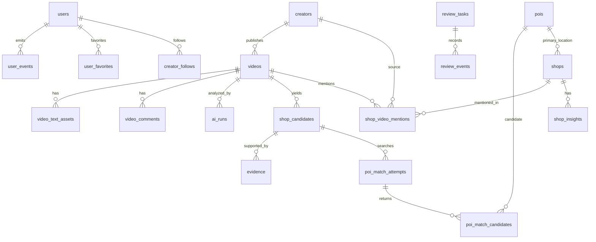

# GoWith MVP 数据库表结构设计

版本：v0.1  
日期：2026-06-16  
关联文档：

- [MVP 文档](./MVP-bilibili-shop-map.md)
- [AI 工作流与后台审核规格](./MVP-ai-workflow-and-admin-spec.md)

目标：为 MVP 建立一套可落库、可追溯、可审核、可训练推荐模型的 PostgreSQL/PostGIS 数据结构。

## 1. 设计目标

数据库需要同时支撑 5 件事：

- B站数据采集：博主、视频、字幕、ASR、评论、原始响应。
- AI 工作流：分类、候选店铺、评论线索、结构化总结、证据链。
- POI 与店铺实体：高德 POI、候选匹配、店铺合并、发布快照。
- 后台审核：任务队列、人工修改、审计日志、状态流转。
- 前台与推荐：用户、收藏、关注、曝光、点击、导航等行为日志。

核心原则：

- 原始数据、中间结果、人工审核结果、前台发布结果分层保存。
- `shop_candidates` 不等于 `shops`。候选店铺经过 POI 匹配和审核后才能成为正式店铺。
- AI 输出必须保留原始 JSON，便于调试、回放和模型评估。
- 前台读取尽量走 `shops` 和发布快照，不直接读未审核 AI 中间表。
- 地图点位统一通过 `pois` 和 `shops.primary_poi_id` 管理。
- 推荐系统从第一天记录曝光与行为，不等模型上线后再补。

## 2. 技术前提

数据库：PostgreSQL 16+  
扩展：PostGIS、pgcrypto、pg_trgm；向量检索可后续加 pgvector。

推荐扩展（已在 `db/migrations/001_extensions_and_base.sql` 中 `CREATE EXTENSION IF NOT EXISTS`）：

```sql
CREATE EXTENSION IF NOT EXISTS postgis;
CREATE EXTENSION IF NOT EXISTS pgcrypto;
CREATE EXTENSION IF NOT EXISTS pg_trgm;
-- 可选：CREATE EXTENSION IF NOT EXISTS vector;
```

通用字段约定：

| 字段         | 类型             | 说明                                                   |
| ------------ | ---------------- | ------------------------------------------------------ |
| `id`         | uuid             | 主键，默认 `gen_random_uuid()`                         |
| `created_at` | timestamptz      | 创建时间，默认 `now()`                                 |
| `updated_at` | timestamptz      | 更新时间，由 `set_updated_at()` 触发器自动维护（见下） |
| `deleted_at` | timestamptz/null | 软删除，可选                                           |
| `status`     | text             | 状态枚举，业务层校验                                   |
| `metadata`   | jsonb            | 低频扩展字段                                           |

MVP 建议用 `text + CHECK` 或业务层枚举，而不是大量 PostgreSQL enum。原因是 AI 状态、风险标记、审核状态还会快速迭代。

### 2.1 `set_updated_at()` 触发器函数

`db/migrations/001_extensions_and_base.sql` 定义了一个全局 `set_updated_at()` 函数：

```sql
CREATE OR REPLACE FUNCTION set_updated_at()
RETURNS trigger AS $$
BEGIN
  NEW.updated_at = now();
  RETURN NEW;
END;
$$ LANGUAGE plpgsql;
```

下列表在各自 migration 内 `DROP TRIGGER IF EXISTS ... ; CREATE TRIGGER ... BEFORE UPDATE ... EXECUTE FUNCTION set_updated_at();` 挂上触发器：`users`、`bilibili_auth_accounts`、`creators`、`videos`、`jobs`、`video_text_assets`、`shop_candidates`、`pois`、`shops`、`shop_insights`、`review_tasks`、`user_favorites`。

没有触发器的表（写入一次性，不应自动更新时间戳）：`auth_sessions`（不更新）、`raw_ingest_payloads`（不更新）、`video_text_segments`（append-only）、`video_comments`（append-only）、`ai_runs`（append-only）、`video_classifications`、`comment_signal_extractions`、`ai_video_analyses`、`evidence`（append-only）、`shop_aliases`、`shop_video_mentions`、`published_shop_snapshots`、`creator_follows`、`recommendation_requests`、`recommendation_items`、`user_events`、`poi_match_attempts`、`poi_match_candidates`。

修改任何带触发器的表时要意识到 `updated_at` 会被自动覆写。

## 3. 分层总览



## 4. 枚举与状态值

### 4.1 视频状态 `videos.workflow_status`

```text
new
metadata_synced
subtitle_ready
asr_ready
text_unavailable
classified
non_shop_visit
shop_candidates_extracted
ai_structured
poi_matching
need_review
approved
published
rejected
failed
```

### 4.2 店铺候选状态 `shop_candidates.status`

```text
extracted
name_missing
poi_candidates_found
poi_match_low_confidence
poi_match_need_review
poi_matched
merged
approved
published
rejected
```

### 4.3 审核任务状态 `review_tasks.status`

```text
open
in_progress
resolved
rejected
cancelled
```

### 4.4 店铺发布状态 `shops.status`

```text
draft
published
hidden
needs_recheck
rejected
merged
```

## 5. 用户与权限

### 5.1 `users`

用户表。MVP 需要登录系统，后台只有一个人使用也建议把管理员作为 `role = admin`。

| 字段            | 类型             | 说明                  |
| --------------- | ---------------- | --------------------- |
| `id`            | uuid PK          | 用户 ID               |
| `email`         | text/null        | 邮箱                  |
| `phone`         | text/null        | 手机号                |
| `username`      | text/null        | 用户名                |
| `display_name`  | text/null        | 展示名                |
| `avatar_url`    | text/null        | 头像                  |
| `role`          | text             | `user` / `admin`      |
| `status`        | text             | `active` / `disabled` |
| `password_hash` | text/null        | 如使用账号密码        |
| `last_login_at` | timestamptz/null | 最近登录              |
| `created_at`    | timestamptz      | 创建时间              |
| `updated_at`    | timestamptz      | 更新时间              |

索引：

```sql
CREATE UNIQUE INDEX users_email_uidx ON users (email) WHERE email IS NOT NULL;
CREATE UNIQUE INDEX users_phone_uidx ON users (phone) WHERE phone IS NOT NULL;
CREATE INDEX users_role_idx ON users (role);
```

### 5.2 `auth_sessions`

普通用户登录会话。

| 字段                 | 类型             | 说明                      |
| -------------------- | ---------------- | ------------------------- |
| `id`                 | uuid PK          | 会话 ID                   |
| `user_id`            | uuid FK          | 用户                      |
| `session_token_hash` | text             | 会话 token hash           |
| `client_type`        | text             | `web` / `miniapp` / `app` |
| `ip_hash`            | text/null        | IP hash                   |
| `user_agent`         | text/null        | UA                        |
| `expires_at`         | timestamptz      | 过期时间                  |
| `revoked_at`         | timestamptz/null | 撤销时间                  |
| `created_at`         | timestamptz      | 创建时间                  |

索引：

```sql
CREATE UNIQUE INDEX auth_sessions_token_uidx ON auth_sessions (session_token_hash);
CREATE INDEX auth_sessions_user_idx ON auth_sessions (user_id, expires_at DESC);
```

## 6. B站采集层

### 6.1 `bilibili_auth_accounts`

服务端统一维护 B站登录态。Cookie 必须加密保存。

| 字段                   | 类型             | 说明                                     |
| ---------------------- | ---------------- | ---------------------------------------- |
| `id`                   | uuid PK          | 登录态 ID                                |
| `label`                | text             | 备注名                                   |
| `encrypted_cookie`     | text             | 加密 Cookie                              |
| `csrf_token_encrypted` | text/null        | 加密 token                               |
| `status`               | text             | `active` / `expired` / `paused` / `risk` |
| `last_health_check_at` | timestamptz/null | 最近健康检查                             |
| `last_success_at`      | timestamptz/null | 最近成功请求                             |
| `last_error_code`      | text/null        | 最近错误码                               |
| `last_error_message`   | text/null        | 最近错误                                 |
| `rate_limit_policy`    | jsonb            | 限流配置                                 |
| `created_at`           | timestamptz      | 创建时间                                 |
| `updated_at`           | timestamptz      | 更新时间                                 |

索引：

```sql
CREATE INDEX bilibili_auth_accounts_status_idx ON bilibili_auth_accounts (status);
```

### 6.2 `creators`

B站博主表。

| 字段                      | 类型             | 说明                          |
| ------------------------- | ---------------- | ----------------------------- |
| `id`                      | uuid PK          | 内部博主 ID                   |
| `bilibili_uid`            | text             | B站 UID                       |
| `name`                    | text             | 昵称                          |
| `avatar_url`              | text/null        | 头像                          |
| `profile_url`             | text             | B站主页                       |
| `bio`                     | text/null        | 简介                          |
| `follower_count`          | bigint/null      | 粉丝数                        |
| `status`                  | text             | `active` / `paused` / `error` |
| `sync_mode`               | text             | `full` / `incremental`        |
| `last_synced_at`          | timestamptz/null | 最近同步                      |
| `last_video_published_at` | timestamptz/null | 最近视频发布时间              |
| `stats`                   | jsonb            | 统计快照                      |
| `raw_payload_id`          | uuid/null        | 原始响应                      |
| `created_at`              | timestamptz      | 创建时间                      |
| `updated_at`              | timestamptz      | 更新时间                      |

索引：

```sql
CREATE UNIQUE INDEX creators_bilibili_uid_uidx ON creators (bilibili_uid);
CREATE INDEX creators_status_idx ON creators (status);
CREATE INDEX creators_name_trgm_idx ON creators USING GIN (name gin_trgm_ops);
```

### 6.3 `videos`

B站视频主表。

| 字段                        | 类型              | 说明                     |
| --------------------------- | ----------------- | ------------------------ |
| `id`                        | uuid PK           | 内部视频 ID              |
| `creator_id`                | uuid FK           | 博主                     |
| `bvid`                      | text              | BV号                     |
| `aid`                       | text/null         | AV号                     |
| `cid`                       | text/null         | 默认 CID                 |
| `title`                     | text              | 标题                     |
| `description`               | text/null         | 简介                     |
| `cover_url`                 | text/null         | 封面                     |
| `source_url`                | text              | B站链接                  |
| `duration_sec`              | integer/null      | 时长                     |
| `published_at`              | timestamptz/null  | 发布时间                 |
| `tags`                      | text[]            | 标签                     |
| `category`                  | text/null         | B站分区                  |
| `stats`                     | jsonb             | 播放、点赞、收藏、评论等 |
| `workflow_status`           | text              | 工作流状态               |
| `is_shop_visit`             | boolean/null      | 是否探店                 |
| `content_type`              | text/null         | 内容类型                 |
| `classification_confidence` | numeric(4,3)/null | 分类置信度               |
| `risk_flags`                | text[]            | 风险标记                 |
| `raw_payload_id`            | uuid/null         | 原始响应                 |
| `last_synced_at`            | timestamptz/null  | 最近同步                 |
| `created_at`                | timestamptz       | 创建时间                 |
| `updated_at`                | timestamptz       | 更新时间                 |

索引：

```sql
CREATE UNIQUE INDEX videos_bvid_uidx ON videos (bvid);
CREATE INDEX videos_creator_published_idx ON videos (creator_id, published_at DESC);
CREATE INDEX videos_workflow_status_idx ON videos (workflow_status);
CREATE INDEX videos_is_shop_visit_idx ON videos (is_shop_visit) WHERE is_shop_visit IS NOT NULL;
CREATE INDEX videos_title_trgm_idx ON videos USING GIN (title gin_trgm_ops);
```

### 6.4 `raw_ingest_payloads`

保存外部 API 原始响应，用于排查、回放和字段重解析。

| 字段             | 类型             | 说明                                              |
| ---------------- | ---------------- | ------------------------------------------------- |
| `id`             | uuid PK          | 原始响应 ID                                       |
| `provider`       | text             | `bilibili` / `amap` / `groq` / `openai`           |
| `resource_type`  | text             | `creator` / `video` / `comment` / `poi_search` 等 |
| `resource_key`   | text             | 外部资源标识                                      |
| `request_hash`   | text             | 请求参数 hash                                     |
| `payload`        | jsonb/null       | 小响应直接入库                                    |
| `object_key`     | text/null        | 大响应对象存储地址                                |
| `payload_sha256` | text             | 内容 hash                                         |
| `fetched_at`     | timestamptz      | 获取时间                                          |
| `expires_at`     | timestamptz/null | 可选过期                                          |
| `created_at`     | timestamptz      | 创建时间                                          |

索引：

```sql
CREATE INDEX raw_ingest_provider_resource_idx ON raw_ingest_payloads (provider, resource_type, resource_key);
CREATE UNIQUE INDEX raw_ingest_request_hash_uidx ON raw_ingest_payloads (provider, request_hash);
```

## 7. 文本资产与评论

### 7.1 `video_text_assets`

字幕或 ASR 结果。长文本可同时存 `content_text` 和对象存储 `object_key`。

| 字段             | 类型        | 说明                    |
| ---------------- | ----------- | ----------------------- |
| `id`             | uuid PK     | 文本资产 ID             |
| `video_id`       | uuid FK     | 视频                    |
| `source`         | text        | `subtitle` / `asr`      |
| `language`       | text/null   | 语言                    |
| `content_text`   | text        | 合并文本                |
| `content_sha256` | text        | 文本 hash               |
| `segments`       | jsonb       | 带时间戳片段            |
| `model_provider` | text/null   | ASR provider，如 `groq` |
| `model_name`     | text/null   | ASR 模型                |
| `status`         | text        | `ready` / `failed`      |
| `error_message`  | text/null   | 错误                    |
| `object_key`     | text/null   | 原始字幕/ASR 文件       |
| `created_at`     | timestamptz | 创建时间                |
| `updated_at`     | timestamptz | 更新时间                |

索引：

```sql
CREATE INDEX video_text_assets_video_idx ON video_text_assets (video_id, source);
CREATE UNIQUE INDEX video_text_assets_hash_uidx ON video_text_assets (video_id, source, content_sha256);
```

### 7.2 `video_text_segments`

把字幕/ASR 片段拆表，便于证据引用和后台时间轴展示。

| 字段            | 类型               | 说明       |
| --------------- | ------------------ | ---------- |
| `id`            | uuid PK            | 片段 ID    |
| `asset_id`      | uuid FK            | 文本资产   |
| `video_id`      | uuid FK            | 视频       |
| `segment_index` | integer            | 顺序       |
| `start_sec`     | numeric(10,3)/null | 开始秒     |
| `end_sec`       | numeric(10,3)/null | 结束秒     |
| `text`          | text               | 片段文本   |
| `confidence`    | numeric(4,3)/null  | ASR 置信度 |
| `created_at`    | timestamptz        | 创建时间   |

索引：

```sql
CREATE INDEX video_text_segments_asset_idx ON video_text_segments (asset_id, segment_index);
CREATE INDEX video_text_segments_video_time_idx ON video_text_segments (video_id, start_sec);
CREATE INDEX video_text_segments_text_trgm_idx ON video_text_segments USING GIN (text gin_trgm_ops);
```

### 7.3 `video_comments`

评论样本表。MVP 中评论主要用于 AI 和后台，不默认在前台展示原文。

| 字段                       | 类型             | 说明                                       |
| -------------------------- | ---------------- | ------------------------------------------ |
| `id`                       | uuid PK          | 评论 ID                                    |
| `video_id`                 | uuid FK          | 视频                                       |
| `platform_comment_id`      | text             | B站评论 ID                                 |
| `parent_comment_id`        | text/null        | 父评论                                     |
| `content`                  | text             | 评论内容                                   |
| `content_sha256`           | text             | 内容 hash                                  |
| `user_hash`                | text/null        | 评论用户匿名 hash                          |
| `author_name`              | text/null        | 后台证据视图使用的评论昵称；公共页面不展示 |
| `author_avatar_url`        | text/null        | 后台证据视图使用的头像源 URL               |
| `image_urls`               | text[]           | 评论附图源 URL；默认空数组                 |
| `like_count`               | integer/null     | 点赞数                                     |
| `reply_count`              | integer/null     | 回复数                                     |
| `published_at`             | timestamptz/null | 评论时间                                   |
| `sample_type`              | text             | `hot` / `latest` / `keyword`               |
| `contains_location_signal` | boolean          | 是否有位置线索                             |
| `contains_shop_signal`     | boolean          | 是否有店铺线索                             |
| `raw_payload_id`           | uuid/null        | 原始响应                                   |
| `created_at`               | timestamptz      | 创建时间                                   |

索引：

```sql
CREATE UNIQUE INDEX video_comments_platform_uidx ON video_comments (platform_comment_id);
CREATE INDEX video_comments_video_sample_idx ON video_comments (video_id, sample_type, like_count DESC);
CREATE INDEX video_comments_signal_idx ON video_comments (video_id) WHERE contains_location_signal OR contains_shop_signal;
CREATE INDEX video_comments_content_trgm_idx ON video_comments USING GIN (content gin_trgm_ops);
```

## 8. AI 工作流表

### 8.1 `ai_runs`

所有 AI 调用统一记录，便于成本、调试和回放。

| 字段              | 类型             | 说明                                                                                |
| ----------------- | ---------------- | ----------------------------------------------------------------------------------- |
| `id`              | uuid PK          | AI 调用 ID                                                                          |
| `parent_ai_run_id` | uuid/null FK    | 递进式调用的父阶段；顶层调用为空                                                    |
| `call_index`       | integer/null     | 同一父阶段内的调用顺序                                                              |
| `stage`           | text             | `classify_video` / `extract_shop_candidates` / `comment_signal` / `structure_video` |
| `entity_type`     | text             | `video` / `shop_candidate`                                                          |
| `entity_id`       | uuid             | 关联实体                                                                            |
| `provider`        | text             | `openai` / `groq` 等                                                                |
| `model`           | text             | 模型名                                                                              |
| `prompt_version`  | text             | Prompt 版本                                                                         |
| `input_hash`      | text             | 输入 hash                                                                           |
| `input_payload`   | jsonb            | 输入摘要，避免过大                                                                  |
| `output_payload`  | jsonb/null       | 模型 JSON 输出                                                                      |
| `raw_output_text` | text/null        | 原始输出                                                                            |
| `usage`           | jsonb            | token/音频秒数/成本                                                                 |
| `status`          | text             | `success` / `failed` / `invalid_json` / `schema_error`                              |
| `error_message`   | text/null        | 错误                                                                                |
| `started_at`      | timestamptz      | 开始时间                                                                            |
| `finished_at`     | timestamptz/null | 结束时间                                                                            |
| `created_at`      | timestamptz      | 创建时间                                                                            |

索引：

```sql
CREATE INDEX ai_runs_entity_idx ON ai_runs (entity_type, entity_id, stage, created_at DESC);
CREATE INDEX ai_runs_status_idx ON ai_runs (status, stage);
CREATE INDEX ai_runs_input_hash_idx ON ai_runs (stage, input_hash);
CREATE INDEX ai_runs_parent_idx ON ai_runs (parent_ai_run_id, call_index) WHERE parent_ai_run_id IS NOT NULL;
```

`pipeline_runs` / `pipeline_events` 通过 migration `010_admin_task_realtime.sql` 安装轻量 `pg_notify` 触发器，只发送 run、实体、阶段、状态和进度标识；完整数据仍从表和增量 API 读取。

### 8.2 `video_classifications`

视频是否探店的 AI 分类结果。

| 字段                 | 类型         | 说明        |
| -------------------- | ------------ | ----------- |
| `id`                 | uuid PK      | 分类结果 ID |
| `video_id`           | uuid FK      | 视频        |
| `ai_run_id`          | uuid FK      | AI 调用     |
| `is_shop_visit`      | boolean      | 是否探店    |
| `content_type`       | text         | 内容类型    |
| `confidence`         | numeric(4,3) | 置信度      |
| `reason_codes`       | text[]       | 原因        |
| `risk_flags`         | text[]       | 风险        |
| `need_manual_review` | boolean      | 是否需审    |
| `evidence_ids`       | uuid[]       | 证据        |
| `created_at`         | timestamptz  | 创建时间    |

索引：

```sql
CREATE INDEX video_classifications_video_idx ON video_classifications (video_id, created_at DESC);
CREATE INDEX video_classifications_need_review_idx ON video_classifications (need_manual_review) WHERE need_manual_review;
```

### 8.3 `comment_signal_extractions`

评论区店铺线索分析结果。

| 字段                 | 类型        | 说明         |
| -------------------- | ----------- | ------------ |
| `id`                 | uuid PK     | 结果 ID      |
| `video_id`           | uuid FK     | 视频         |
| `ai_run_id`          | uuid FK     | AI 调用      |
| `sample_strategy`    | jsonb       | 评论抽样策略 |
| `shop_name_mentions` | jsonb       | 店名线索     |
| `address_mentions`   | jsonb       | 地址线索     |
| `status_mentions`    | jsonb       | 搬迁、闭店等 |
| `aspect_sentiments`  | jsonb       | 维度情绪     |
| `risk_flags`         | text[]      | 风险         |
| `created_at`         | timestamptz | 创建时间     |

索引：

```sql
CREATE INDEX comment_signal_video_idx ON comment_signal_extractions (video_id, created_at DESC);
CREATE INDEX comment_signal_risk_gin_idx ON comment_signal_extractions USING GIN (risk_flags);
```

### 8.4 `ai_video_analyses`

视频级结构化分析完整输出。

| 字段                   | 类型              | 说明                                 |
| ---------------------- | ----------------- | ------------------------------------ |
| `id`                   | uuid PK           | 分析 ID                              |
| `video_id`             | uuid FK           | 视频                                 |
| `ai_run_id`            | uuid FK           | AI 调用                              |
| `schema_version`       | text              | 如 `video_structured_analysis.v1`    |
| `analysis_json`        | jsonb             | 完整结构化输出                       |
| `overall_summary`      | text/null         | 视频总体摘要                         |
| `analysis_confidence`  | numeric(4,3)/null | 总体置信度                           |
| `shop_candidate_count` | integer           | 候选店铺数                           |
| `risk_flags`           | text[]            | 风险                                 |
| `validation_status`    | text              | `valid` / `invalid` / `needs_review` |
| `validation_errors`    | jsonb             | 校验错误                             |
| `created_at`           | timestamptz       | 创建时间                             |

索引：

```sql
CREATE INDEX ai_video_analyses_video_idx ON ai_video_analyses (video_id, created_at DESC);
CREATE INDEX ai_video_analyses_validation_idx ON ai_video_analyses (validation_status);
CREATE INDEX ai_video_analyses_json_gin_idx ON ai_video_analyses USING GIN (analysis_json);
```

### 8.5 `evidence`

证据链表，连接结论和来源文本。

| 字段                | 类型               | 说明                                                          |
| ------------------- | ------------------ | ------------------------------------------------------------- |
| `id`                | uuid PK            | 证据 ID                                                       |
| `video_id`          | uuid FK/null       | 视频                                                          |
| `shop_candidate_id` | uuid FK/null       | 候选店铺                                                      |
| `shop_id`           | uuid FK/null       | 已发布店铺                                                    |
| `source`            | text               | `title` / `subtitle` / `asr` / `comment` / `manual_review` 等 |
| `source_ref_id`     | uuid/text/null     | 片段、评论或审核事件 ID                                       |
| `text_excerpt`      | text               | 证据片段                                                      |
| `start_sec`         | numeric(10,3)/null | 视频时间                                                      |
| `end_sec`           | numeric(10,3)/null | 视频时间                                                      |
| `confidence`        | numeric(4,3)/null  | 相关性                                                        |
| `metadata`          | jsonb              | 扩展                                                          |
| `created_at`        | timestamptz        | 创建时间                                                      |

索引：

```sql
CREATE INDEX evidence_video_idx ON evidence (video_id);
CREATE INDEX evidence_candidate_idx ON evidence (shop_candidate_id);
CREATE INDEX evidence_shop_idx ON evidence (shop_id);
CREATE INDEX evidence_source_idx ON evidence (source);
```

## 9. 店铺候选与 POI

### 9.1 `shop_candidates`

AI 从视频中抽出的候选店铺。候选可以没有明确店名，也可以最后被驳回。

| 字段                   | 类型               | 说明                                     |
| ---------------------- | ------------------ | ---------------------------------------- |
| `id`                   | uuid PK            | 候选 ID                                  |
| `video_id`             | uuid FK            | 来源视频                                 |
| `creator_id`           | uuid FK            | 来源博主                                 |
| `ai_video_analysis_id` | uuid FK/null       | 来源分析                                 |
| `candidate_name`       | text/null          | AI 抽取店名                              |
| `normalized_name`      | text/null          | 规范化店名                               |
| `alias_names`          | text[]             | 别名                                     |
| `candidate_type`       | text               | `physical_shop` / `unknown` / `not_shop` |
| `category_primary`     | text/null          | 一级品类                                 |
| `category_secondary`   | text/null          | 二级品类                                 |
| `province`             | text/null          | 省                                       |
| `city`                 | text/null          | 市                                       |
| `district`             | text/null          | 区县                                     |
| `business_area`        | text/null          | 商圈                                     |
| `address_hint`         | text/null          | 地址线索                                 |
| `landmarks`            | text[]             | 地标                                     |
| `time_start_sec`       | numeric(10,3)/null | 视频中开始                               |
| `time_end_sec`         | numeric(10,3)/null | 视频中结束                               |
| `name_confidence`      | numeric(4,3)/null  | 店名置信度                               |
| `location_confidence`  | numeric(4,3)/null  | 位置置信度                               |
| `summary_confidence`   | numeric(4,3)/null  | 摘要置信度                               |
| `card_payload`         | jsonb              | 卡片文案、推荐菜、避雷点                 |
| `review_dimensions`    | jsonb              | 口味、价格、排队等                       |
| `comment_summary`      | jsonb              | 评论摘要                                 |
| `missing_fields`       | text[]             | 缺失字段                                 |
| `risk_flags`           | text[]             | 风险                                     |
| `status`               | text               | 候选状态                                 |
| `selected_poi_id`      | uuid FK/null       | 已选 POI                                 |
| `merged_shop_id`       | uuid FK/null       | 合并到的正式店铺                         |
| `created_at`           | timestamptz        | 创建时间                                 |
| `updated_at`           | timestamptz        | 更新时间                                 |

索引：

```sql
CREATE INDEX shop_candidates_video_idx ON shop_candidates (video_id);
CREATE INDEX shop_candidates_creator_idx ON shop_candidates (creator_id);
CREATE INDEX shop_candidates_status_idx ON shop_candidates (status);
CREATE INDEX shop_candidates_city_idx ON shop_candidates (city, district);
CREATE INDEX shop_candidates_name_trgm_idx ON shop_candidates USING GIN (candidate_name gin_trgm_ops);
CREATE INDEX shop_candidates_risk_gin_idx ON shop_candidates USING GIN (risk_flags);
```

### 9.2 `pois`

地图服务商 POI 表。MVP 以高德为主，但要保留 provider 抽象。

| 字段              | 类型                  | 说明                         |
| ----------------- | --------------------- | ---------------------------- |
| `id`              | uuid PK               | 内部 POI ID                  |
| `provider`        | text                  | `amap` / `tencent` / `baidu` |
| `provider_poi_id` | text                  | 服务商 POI ID                |
| `name`            | text                  | POI 名称                     |
| `address`         | text/null             | 地址                         |
| `province`        | text/null             | 省                           |
| `city`            | text/null             | 市                           |
| `district`        | text/null             | 区                           |
| `business_area`   | text/null             | 商圈                         |
| `category`        | text/null             | 服务商品类                   |
| `category_code`   | text/null             | 服务商品类码                 |
| `lng`             | numeric(10,6)         | 经度                         |
| `lat`             | numeric(10,6)         | 纬度                         |
| `coord_type`      | text                  | `gcj02` / `bd09` / `wgs84`   |
| `geom`            | geometry(Point, 4326) | 用 provider 坐标生成的点     |
| `phone`           | text/null             | 电话，如服务商返回           |
| `business_hours`  | text/null             | 营业时间，如服务商返回       |
| `raw_payload_id`  | uuid/null             | 原始响应                     |
| `created_at`      | timestamptz           | 创建时间                     |
| `updated_at`      | timestamptz           | 更新时间                     |

约束与索引：

```sql
CREATE UNIQUE INDEX pois_provider_uidx ON pois (provider, provider_poi_id);
CREATE INDEX pois_city_category_idx ON pois (city, district, category);
CREATE INDEX pois_name_trgm_idx ON pois USING GIN (name gin_trgm_ops);
CREATE INDEX pois_geom_gix ON pois USING GIST (geom);
```

坐标注意：

- 高德返回通常是 GCJ-02。
- `geom` 可用于同坐标系近似范围查询，但不要和 WGS-84/BD-09 混用。
- 如后续多 provider 混用，建议增加坐标转换后的 `wgs84_geom`。

### 9.3 `poi_match_attempts`

一次候选店铺的 POI 搜索请求。

| 字段                | 类型        | 说明                                  |
| ------------------- | ----------- | ------------------------------------- |
| `id`                | uuid PK     | 匹配尝试 ID                           |
| `shop_candidate_id` | uuid FK     | 候选店铺                              |
| `provider`          | text        | `amap`                                |
| `query_strategy`    | text        | `city_name_keyword` 等                |
| `query_payload`     | jsonb       | 搜索参数                              |
| `status`            | text        | `success` / `failed` / `no_candidate` |
| `raw_payload_id`    | uuid/null   | 原始响应                              |
| `error_message`     | text/null   | 错误                                  |
| `created_at`        | timestamptz | 创建时间                              |

索引：

```sql
CREATE INDEX poi_match_attempts_candidate_idx ON poi_match_attempts (shop_candidate_id, created_at DESC);
CREATE INDEX poi_match_attempts_provider_idx ON poi_match_attempts (provider, status);
```

### 9.4 `poi_match_candidates`

一次 POI 搜索返回的候选点及本地重排分。

| 字段                | 类型         | 说明                                  |
| ------------------- | ------------ | ------------------------------------- |
| `id`                | uuid PK      | 候选匹配 ID                           |
| `attempt_id`        | uuid FK      | 匹配尝试                              |
| `shop_candidate_id` | uuid FK      | 候选店铺                              |
| `poi_id`            | uuid FK      | POI                                   |
| `rank`              | integer      | 服务商或本地排序                      |
| `match_features`    | jsonb        | 名称、地址、品类等特征分              |
| `match_score`       | numeric(5,4) | 综合分                                |
| `match_status`      | text         | `candidate` / `selected` / `rejected` |
| `created_at`        | timestamptz  | 创建时间                              |

索引：

```sql
CREATE INDEX poi_match_candidates_candidate_idx ON poi_match_candidates (shop_candidate_id, match_score DESC);
CREATE INDEX poi_match_candidates_attempt_idx ON poi_match_candidates (attempt_id, rank);
CREATE INDEX poi_match_candidates_poi_idx ON poi_match_candidates (poi_id);
```

## 10. 正式店铺与内容聚合

### 10.1 `shops`

审核和合并后的正式店铺实体，前台主要读取此表。

| 字段                 | 类型                  | 说明                     |
| -------------------- | --------------------- | ------------------------ |
| `id`                 | uuid PK               | 店铺 ID                  |
| `primary_poi_id`     | uuid FK               | 主 POI                   |
| `canonical_name`     | text                  | 规范店名                 |
| `display_name`       | text                  | 前台展示店名             |
| `category_primary`   | text/null             | 一级品类                 |
| `category_secondary` | text/null             | 二级品类                 |
| `province`           | text/null             | 省                       |
| `city`               | text/null             | 市                       |
| `district`           | text/null             | 区                       |
| `business_area`      | text/null             | 商圈                     |
| `address`            | text/null             | 地址                     |
| `lng`                | numeric(10,6)         | 经度                     |
| `lat`                | numeric(10,6)         | 纬度                     |
| `coord_type`         | text                  | 坐标系                   |
| `geom`               | geometry(Point, 4326) | 空间点                   |
| `avg_price_hint`     | text/null             | 人均提示                 |
| `card_payload`       | jsonb                 | 前台卡片展示数据         |
| `aggregated_review`  | jsonb                 | 聚合评价                 |
| `quality`            | jsonb                 | 置信度、审核状态等       |
| `source_stats`       | jsonb                 | 来源视频/博主/评论数量   |
| `status`             | text                  | `draft` / `published` 等 |
| `published_at`       | timestamptz/null      | 发布时间                 |
| `last_reviewed_at`   | timestamptz/null      | 最近审核                 |
| `created_at`         | timestamptz           | 创建时间                 |
| `updated_at`         | timestamptz           | 更新时间                 |

索引：

```sql
CREATE INDEX shops_status_city_idx ON shops (status, city, district);
CREATE INDEX shops_category_idx ON shops (category_primary, category_secondary);
CREATE INDEX shops_name_trgm_idx ON shops USING GIN (display_name gin_trgm_ops);
CREATE INDEX shops_geom_gix ON shops USING GIST (geom);
CREATE INDEX shops_published_idx ON shops (published_at DESC) WHERE status = 'published';
```

### 10.2 `shop_aliases`

店铺别名表，用于合并和搜索。

| 字段         | 类型              | 说明                    |
| ------------ | ----------------- | ----------------------- |
| `id`         | uuid PK           | 别名 ID                 |
| `shop_id`    | uuid FK           | 店铺                    |
| `alias_name` | text              | 别名                    |
| `source`     | text              | `ai` / `manual` / `poi` |
| `confidence` | numeric(4,3)/null | 置信度                  |
| `created_at` | timestamptz       | 创建时间                |

索引：

```sql
CREATE INDEX shop_aliases_shop_idx ON shop_aliases (shop_id);
CREATE INDEX shop_aliases_name_trgm_idx ON shop_aliases USING GIN (alias_name gin_trgm_ops);
```

### 10.3 `shop_video_mentions`

正式店铺与视频、博主的关联。它是“某个视频提到了某家店”的事实表。

| 字段                | 类型               | 说明                             |
| ------------------- | ------------------ | -------------------------------- |
| `id`                | uuid PK            | 关联 ID                          |
| `shop_id`           | uuid FK            | 店铺                             |
| `shop_candidate_id` | uuid FK/null       | 来源候选                         |
| `video_id`          | uuid FK            | 视频                             |
| `creator_id`        | uuid FK            | 博主                             |
| `mention_type`      | text               | `main` / `secondary` / `passing` |
| `sentiment`         | text               | 正负向                           |
| `confidence`        | numeric(4,3)       | 置信度                           |
| `time_start_sec`    | numeric(10,3)/null | 视频开始                         |
| `time_end_sec`      | numeric(10,3)/null | 视频结束                         |
| `summary`           | text/null          | 该视频对该店摘要                 |
| `evidence_ids`      | uuid[]             | 证据                             |
| `created_at`        | timestamptz        | 创建时间                         |

索引：

```sql
CREATE UNIQUE INDEX shop_video_mentions_unique_idx ON shop_video_mentions (shop_id, video_id, mention_type);
CREATE INDEX shop_video_mentions_shop_idx ON shop_video_mentions (shop_id);
CREATE INDEX shop_video_mentions_creator_idx ON shop_video_mentions (creator_id, video_id);
CREATE INDEX shop_video_mentions_video_idx ON shop_video_mentions (video_id);
```

### 10.4 `shop_insights`

店铺维度评价结论，可来自单视频或多视频聚合。

| 字段            | 类型         | 说明                                         |
| --------------- | ------------ | -------------------------------------------- |
| `id`            | uuid PK      | 结论 ID                                      |
| `shop_id`       | uuid FK      | 店铺                                         |
| `dimension`     | text         | `taste` / `price` / `queue` / `service` 等   |
| `sentiment`     | text         | 情绪                                         |
| `summary`       | text         | 摘要                                         |
| `confidence`    | numeric(4,3) | 置信度                                       |
| `source_type`   | text         | `video` / `comment` / `aggregate` / `manual` |
| `source_ids`    | uuid[]       | 来源                                         |
| `evidence_ids`  | uuid[]       | 证据                                         |
| `model_version` | text/null    | 模型版本                                     |
| `status`        | text         | `active` / `hidden` / `needs_recheck`        |
| `created_at`    | timestamptz  | 创建时间                                     |
| `updated_at`    | timestamptz  | 更新时间                                     |

索引：

```sql
CREATE INDEX shop_insights_shop_dimension_idx ON shop_insights (shop_id, dimension, status);
CREATE INDEX shop_insights_sentiment_idx ON shop_insights (dimension, sentiment);
```

### 10.5 `published_shop_snapshots`

前台发布快照，用于保证展示稳定，也方便回滚。

| 字段            | 类型         | 说明             |
| --------------- | ------------ | ---------------- |
| `id`            | uuid PK      | 快照 ID          |
| `shop_id`       | uuid FK      | 店铺             |
| `version`       | integer      | 版本             |
| `snapshot_json` | jsonb        | 前台完整展示数据 |
| `published_by`  | uuid FK/null | 操作人           |
| `published_at`  | timestamptz  | 发布时间         |
| `is_current`    | boolean      | 是否当前版本     |

索引：

```sql
CREATE UNIQUE INDEX published_shop_snapshots_current_uidx ON published_shop_snapshots (shop_id) WHERE is_current;
CREATE INDEX published_shop_snapshots_shop_version_idx ON published_shop_snapshots (shop_id, version DESC);
```

## 11. 后台审核

### 11.1 `review_tasks`

后台任务队列。

| 字段          | 类型             | 说明                                                 |
| ------------- | ---------------- | ---------------------------------------------------- |
| `id`          | uuid PK          | 任务 ID                                              |
| `task_type`   | text             | `poi_review` / `shop_name_missing` / `merge_shop` 等 |
| `entity_type` | text             | `video` / `shop_candidate` / `shop`                  |
| `entity_id`   | uuid             | 关联实体                                             |
| `title`       | text             | 任务标题                                             |
| `reason`      | text             | 任务原因                                             |
| `priority`    | integer          | 优先级，数值越大越高                                 |
| `status`      | text             | `open` / `resolved` 等                               |
| `risk_flags`  | text[]           | 风险                                                 |
| `payload`     | jsonb            | 任务上下文                                           |
| `assigned_to` | uuid FK/null     | 分配人                                               |
| `resolved_by` | uuid FK/null     | 处理人                                               |
| `resolved_at` | timestamptz/null | 处理时间                                             |
| `created_at`  | timestamptz      | 创建时间                                             |
| `updated_at`  | timestamptz      | 更新时间                                             |

索引：

```sql
CREATE INDEX review_tasks_status_priority_idx ON review_tasks (status, priority DESC, created_at);
CREATE INDEX review_tasks_entity_idx ON review_tasks (entity_type, entity_id);
CREATE INDEX review_tasks_risk_gin_idx ON review_tasks USING GIN (risk_flags);
```

### 11.2 `review_events`

审核动作审计日志。

| 字段             | 类型         | 说明                                 |
| ---------------- | ------------ | ------------------------------------ |
| `id`             | uuid PK      | 事件 ID                              |
| `review_task_id` | uuid FK/null | 任务                                 |
| `entity_type`    | text         | 实体类型                             |
| `entity_id`      | uuid         | 实体 ID                              |
| `action`         | text         | `select_poi` / `reject_candidate` 等 |
| `before_json`    | jsonb/null   | 修改前                               |
| `after_json`     | jsonb/null   | 修改后                               |
| `reason`         | text/null    | 原因                                 |
| `reviewer_id`    | uuid FK      | 操作人                               |
| `created_at`     | timestamptz  | 创建时间                             |

索引：

```sql
CREATE INDEX review_events_entity_idx ON review_events (entity_type, entity_id, created_at DESC);
CREATE INDEX review_events_task_idx ON review_events (review_task_id, created_at DESC);
```

## 12. 前台用户行为与推荐

### 12.1 `creator_follows`

用户关注博主。

| 字段         | 类型        | 说明     |
| ------------ | ----------- | -------- |
| `id`         | uuid PK     | 记录 ID  |
| `user_id`    | uuid FK     | 用户     |
| `creator_id` | uuid FK     | 博主     |
| `created_at` | timestamptz | 创建时间 |

索引：

```sql
CREATE UNIQUE INDEX creator_follows_unique_idx ON creator_follows (user_id, creator_id);
CREATE INDEX creator_follows_creator_idx ON creator_follows (creator_id);
```

### 12.2 `user_favorites`

收藏、想去、去过都用此表表达。

| 字段          | 类型        | 说明                                  |
| ------------- | ----------- | ------------------------------------- |
| `id`          | uuid PK     | 记录 ID                               |
| `user_id`     | uuid FK     | 用户                                  |
| `shop_id`     | uuid FK     | 店铺                                  |
| `action_type` | text        | `favorite` / `want_to_go` / `visited` |
| `note`        | text/null   | 用户备注                              |
| `created_at`  | timestamptz | 创建时间                              |
| `updated_at`  | timestamptz | 更新时间                              |

索引：

```sql
CREATE UNIQUE INDEX user_favorites_unique_idx ON user_favorites (user_id, shop_id, action_type);
CREATE INDEX user_favorites_shop_idx ON user_favorites (shop_id, action_type);
```

### 12.3 `recommendation_requests`

一次推荐请求，记录上下文。

| 字段              | 类型         | 说明                            |
| ----------------- | ------------ | ------------------------------- |
| `id`              | uuid PK      | 推荐请求 ID                     |
| `user_id`         | uuid FK/null | 登录用户                        |
| `anonymous_id`    | text/null    | 匿名设备 ID                     |
| `surface`         | text         | `home` / `map` / `creator_page` |
| `request_context` | jsonb        | 城市、筛选、位置、端类型        |
| `algorithm`       | text         | `rule_v0` / `ranker_v1`         |
| `model_version`   | text/null    | 模型版本                        |
| `created_at`      | timestamptz  | 创建时间                        |

索引：

```sql
CREATE INDEX recommendation_requests_user_idx ON recommendation_requests (user_id, created_at DESC);
CREATE INDEX recommendation_requests_surface_idx ON recommendation_requests (surface, created_at DESC);
```

### 12.4 `recommendation_items`

一次推荐请求返回的 item 列表，后续训练排序模型需要它。

| 字段               | 类型          | 说明         |
| ------------------ | ------------- | ------------ |
| `id`               | uuid PK       | 推荐 item ID |
| `request_id`       | uuid FK       | 推荐请求     |
| `shop_id`          | uuid FK       | 店铺         |
| `rank`             | integer       | 排名         |
| `score`            | numeric(10,6) | 分数         |
| `reason_codes`     | text[]        | 推荐原因     |
| `feature_snapshot` | jsonb         | 排序特征快照 |
| `created_at`       | timestamptz   | 创建时间     |

索引：

```sql
CREATE UNIQUE INDEX recommendation_items_unique_idx ON recommendation_items (request_id, shop_id);
CREATE INDEX recommendation_items_shop_idx ON recommendation_items (shop_id, created_at DESC);
```

### 12.5 `user_events`

统一行为日志。

| 字段                        | 类型         | 说明                                      |
| --------------------------- | ------------ | ----------------------------------------- |
| `id`                        | uuid PK      | 事件 ID                                   |
| `user_id`                   | uuid FK/null | 登录用户                                  |
| `anonymous_id`              | text/null    | 匿名 ID                                   |
| `event_name`                | text         | `shop_card_click` / `navigation_click` 等 |
| `entity_type`               | text/null    | `shop` / `creator` / `video`              |
| `entity_id`                 | uuid/null    | 目标实体                                  |
| `shop_id`                   | uuid/null    | 店铺快捷字段                              |
| `creator_id`                | uuid/null    | 博主快捷字段                              |
| `video_id`                  | uuid/null    | 视频快捷字段                              |
| `recommendation_request_id` | uuid/null    | 推荐请求                                  |
| `recommendation_item_id`    | uuid/null    | 推荐 item                                 |
| `surface`                   | text         | 发生页面                                  |
| `event_payload`             | jsonb        | 上下文                                    |
| `client_type`               | text         | `web` / `miniapp` / `app`                 |
| `created_at`                | timestamptz  | 发生时间                                  |

索引：

```sql
CREATE INDEX user_events_user_time_idx ON user_events (user_id, created_at DESC);
CREATE INDEX user_events_anon_time_idx ON user_events (anonymous_id, created_at DESC);
CREATE INDEX user_events_name_time_idx ON user_events (event_name, created_at DESC);
CREATE INDEX user_events_shop_idx ON user_events (shop_id, created_at DESC);
CREATE INDEX user_events_reco_idx ON user_events (recommendation_request_id, recommendation_item_id);
```

推荐训练说明：

- 曝光事件必须关联 `recommendation_request_id` 和 `recommendation_item_id`。
- 点击、收藏、想去、导航最好也带上推荐上下文，便于计算 label。
- `feature_snapshot` 保存当时排序特征，避免后续特征变化导致训练样本不可复现。

## 13. 任务与调度

### 13.1 `jobs`

MVP 可用数据库任务表或队列系统。即便用 BullMQ/Redis，也建议保留任务审计表。

| 字段            | 类型             | 说明                                                      |
| --------------- | ---------------- | --------------------------------------------------------- |
| `id`            | uuid PK          | 任务 ID                                                   |
| `job_type`      | text             | `sync_creator_videos` / `fetch_subtitle` / `run_asr` 等   |
| `entity_type`   | text             | 实体类型                                                  |
| `entity_id`     | uuid             | 实体 ID                                                   |
| `payload`       | jsonb            | 参数                                                      |
| `status`        | text             | `queued` / `running` / `success` / `failed` / `cancelled` |
| `priority`      | integer          | 优先级                                                    |
| `attempts`      | integer          | 已尝试次数                                                |
| `max_attempts`  | integer          | 最大尝试                                                  |
| `scheduled_at`  | timestamptz      | 计划时间                                                  |
| `started_at`    | timestamptz/null | 开始                                                      |
| `finished_at`   | timestamptz/null | 结束                                                      |
| `error_code`    | text/null        | 错误码                                                    |
| `error_message` | text/null        | 错误                                                      |
| `created_at`    | timestamptz      | 创建                                                      |
| `updated_at`    | timestamptz      | 更新                                                      |

索引：

```sql
CREATE INDEX jobs_queue_idx ON jobs (status, priority DESC, scheduled_at);
CREATE INDEX jobs_entity_idx ON jobs (entity_type, entity_id, created_at DESC);
CREATE INDEX jobs_type_status_idx ON jobs (job_type, status);
```

## 14. 关键关系与生命周期

### 14.1 视频到店铺

```text
creators
-> videos
-> video_text_assets / video_comments
-> ai_runs
-> ai_video_analyses
-> shop_candidates
-> poi_match_attempts / poi_match_candidates
-> shops
-> shop_video_mentions
-> published_shop_snapshots
```

### 14.2 审核任务生成规则

自动生成 `review_tasks` 的情况：

- 视频分类置信度低。
- `shop_name_missing`。
- `generic_name_risk`。
- `multiple_shops_in_video`。
- `poi_no_candidate`。
- `poi_low_confidence`。
- `poi_many_same_name_candidates`。
- 评论提到搬迁/闭店。
- AI 输出校验失败。

### 14.3 前台读取路径

首页卡片：

```text
shops(status = published)
+ published_shop_snapshots(is_current = true)
+ shop_video_mentions
+ creators
```

地图页：

```text
shops(status = published)
where geom within viewport
```

店铺详情：

```text
shops
+ pois
+ shop_insights
+ shop_video_mentions
+ videos
+ creators
+ evidence
```

后台审核：

```text
review_tasks
+ videos
+ video_text_segments
+ video_comments
+ shop_candidates
+ poi_match_candidates
+ review_events
```

## 15. 空间查询与搜索

### 15.1 地图视窗查询

推荐查询方式：

```sql
SELECT *
FROM shops
WHERE status = 'published'
  AND geom && ST_MakeEnvelope(:min_lng, :min_lat, :max_lng, :max_lat, 4326)
ORDER BY published_at DESC
LIMIT 500;
```

注意：如果 `geom` 存的是高德 GCJ-02 坐标，前端高德地图传入的视窗也是 GCJ-02，二者一致即可。不要拿 WGS-84 视窗直接查 GCJ-02 点。

### 15.2 店铺搜索

MVP 可先用 `pg_trgm`：

```sql
SELECT *
FROM shops
WHERE status = 'published'
  AND display_name % :keyword
ORDER BY similarity(display_name, :keyword) DESC
LIMIT 20;
```

后续接 OpenSearch：

- 店铺名。
- 别名。
- 城市/商圈。
- 菜品。
- 博主名。
- 评论标签。

## 16. 数据保留与隐私

建议：

- B站登录态只存加密值，不打日志。
- 评论用户信息只保存 hash，不保存可识别昵称和头像，除非有明确必要。
- 评论原文默认只用于后台与 AI，不直接前台展示。
- 原始响应可设置保留期限，减少合规风险。
- AI 输入输出保留 prompt version、model version、input hash，便于复现。

## 17. MVP 最小建表清单

第一阶段必须建：

- `users`
- `auth_sessions`
- `bilibili_auth_accounts`
- `creators`
- `videos`
- `raw_ingest_payloads`
- `video_text_assets`
- `video_text_segments`
- `video_comments`
- `ai_runs`
- `video_classifications`
- `comment_signal_extractions`
- `ai_video_analyses`
- `evidence`
- `shop_candidates`
- `pois`
- `poi_match_attempts`
- `poi_match_candidates`
- `shops`
- `shop_aliases`
- `shop_video_mentions`
- `shop_insights`
- `published_shop_snapshots`
- `review_tasks`
- `review_events`
- `creator_follows`
- `user_favorites`
- `recommendation_requests`
- `recommendation_items`
- `user_events`
- `jobs`

可以后置：

- 独立向量表。
- OpenSearch 同步表。
- 多租户/组织表。
- 商家认领表。
- 用户评价表。
- 路线规划表。

## 18. 后续可扩展表

### 18.1 `embeddings`

后续深度推荐和语义搜索使用。

| 字段             | 类型        | 说明                         |
| ---------------- | ----------- | ---------------------------- |
| `id`             | uuid PK     | 向量 ID                      |
| `entity_type`    | text        | `shop` / `video` / `creator` |
| `entity_id`      | uuid        | 实体 ID                      |
| `embedding_type` | text        | `content` / `behavior`       |
| `model`          | text        | 模型名                       |
| `embedding`      | vector/null | pgvector 向量                |
| `embedding_json` | jsonb/null  | 未启用 pgvector 时暂存       |
| `created_at`     | timestamptz | 创建                         |

### 18.2 `user_profiles`

推荐系统用户画像。

| 字段                    | 类型        | 说明     |
| ----------------------- | ----------- | -------- |
| `user_id`               | uuid PK     | 用户     |
| `preferred_cities`      | text[]      | 偏好城市 |
| `preferred_categories`  | text[]      | 偏好品类 |
| `preferred_price_range` | jsonb       | 价格偏好 |
| `creator_affinity`      | jsonb       | 博主偏好 |
| `profile_vector_id`     | uuid/null   | 用户向量 |
| `updated_at`            | timestamptz | 更新时间 |

## 19. 实施建议

开发顺序：

1. 建用户、博主、视频、原始响应、任务表。
2. 建字幕/ASR、评论、AI 调用和证据表。
3. 建候选店铺、POI 匹配、正式店铺表。
4. 建审核任务和审核事件。
5. 建前台行为与推荐日志。
6. 再做搜索、向量、画像等增强。

迁移建议：

- 第一个 migration 只建扩展、基础表和索引。
- 第二个 migration 加 AI 与候选店铺表。
- 第三个 migration 加 POI/shops/review。
- 第四个 migration 加推荐日志。

实际落地：

- 迁移执行器：`scripts/migrate.ts` 按文件名顺序应用，建立 `schema_migrations(id, applied_at)` 表幂等追踪；每次启动 `pnpm db:migrate` 即可。
- 数据库 schema 是 ground truth；`packages/db/src/schema.ts`（Kysely 类型镜像）必须与之一致，详见 §19.5。

## 19.5 `pois.geom` / `shops.geom` 与坐标列

实际 migration 把 `geom` 实现为 **GENERATED ALWAYS AS STORED**，从 `lng` / `lat` 自动计算，禁止手动写入：

```sql
geom geometry(Point, 4326) GENERATED ALWAYS AS (
  ST_SetSRID(ST_MakePoint(lng::double precision, lat::double precision), 4326)
) STORED
```

应用层（`apps/api/src/routes/public.ts` 的 `/api/shops/map`）用 `geom && ST_MakeEnvelope(...)` 做视窗查询，必须保证前端传入的视窗坐标与 `coord_type` 同坐标系（默认 GCJ-02）。

`packages/db/src/schema.ts` 当前**未暴露** `geom` 字段（类型镜像只有 `lng`/`lat`/`coord_type`）。若在 TS 侧需要用 `geom`，先在 `schema.ts` 加 `geom` 字段（`Generated<...>`），再从 Kysely 拼 SQL（不要尝试插入）。

## 20. `packages/db/src/schema.ts` 与 SQL 的已知 drift

`packages/db/src/schema.ts` 是 Kysely 类型镜像，部分表的列定义与 SQL 不一致。**M1 之前必须修复**，否则后续在 TS 侧写 review / shop-insights / shop-mentions 业务时会 runtime 报错。

| 表                    | TS 类型（`packages/db/src/schema.ts`）                                                                                                     | SQL 实际（`db/migrations/003_*`）                                                                                                                                                                                               | 差异                           | 影响                                                 |
| --------------------- | ------------------------------------------------------------------------------------------------------------------------------------------ | ------------------------------------------------------------------------------------------------------------------------------------------------------------------------------------------------------------------------------- | ------------------------------ | ---------------------------------------------------- |
| `shop_video_mentions` | `mention_type: "primary" \| "secondary" \| "comparison"`、无 `sentiment`/`summary`/`time_start_sec`/`time_end_sec`、无 `shop_candidate_id` | `mention_type text NOT NULL DEFAULT 'main'`、`sentiment text NOT NULL DEFAULT 'unknown'`、`summary text`、`time_start_sec numeric(10,3)`、`time_end_sec numeric(10,3)`、`shop_candidate_id uuid REFERENCES shop_candidates(id)` | 枚举值不同；缺字段；多 FK      | 写 mention 时 Kysely 会因列不存在 / 类型不匹配报错   |
| `shop_insights`       | `insight_type`、`payload jsonb`、`source_video_ids`、`source_comment_ids`                                                                  | `dimension`、`sentiment`、`summary`、`confidence`、`source_type`、`source_ids`、`evidence_ids`、`model_version`、`status`                                                                                                       | 字段命名 / 含义完全不同        | 完全不能用现有 TS 类型写 insight                     |
| `review_events`       | `task_id`、`actor_id`、`note`                                                                                                              | `review_task_id`、`reviewer_id`、`reason`                                                                                                                                                                                       | 字段命名不同                   | 写 audit 日志时会因列名错报错                        |
| `shop_aliases`        | 无 `confidence`                                                                                                                            | 有 `confidence numeric(4,3)`                                                                                                                                                                                                    | 缺字段                         | 影响搜索相似度权重（如后续用到）                     |
| `shops`               | 无 `geom`                                                                                                                                  | `geom GENERATED ALWAYS AS STORED`                                                                                                                                                                                               | 缺字段（不需要写，但需要声明） | 不影响写入，但 TS 拼 SQL `ST_*` 表达式时类型推断不到 |
| `pois`                | 无 `geom`                                                                                                                                  | 同上                                                                                                                                                                                                                            | 同上                           | 同上                                                 |

修复流程：

1. `git diff packages/db/src/schema.ts db/migrations/` 列差异。
2. **SQL 是 ground truth**：先把 TS 类型对齐 SQL 的列名、类型、`null` 性、`Generated` 标记。
3. 若 TS 设计更合理（如 `review_events.actor_id` 比 `reviewer_id` 通用），写新 migration `db/migrations/005_review_events_rename.sql` 改 SQL，**不要**回填已部署数据库的列名。
4. 同步更新本文件 §3 ER 图与对应章节。
5. CI 加静态检查（`grep -E "review_events\.\(task_id\|actor_id\|note\)" packages/` 应为空）。

修复顺序建议：先 `review_events`（最常用），再 `shop_video_mentions`（review 流程依赖），最后 `shop_insights`（暂未用）、`shop_aliases`（次要）。
